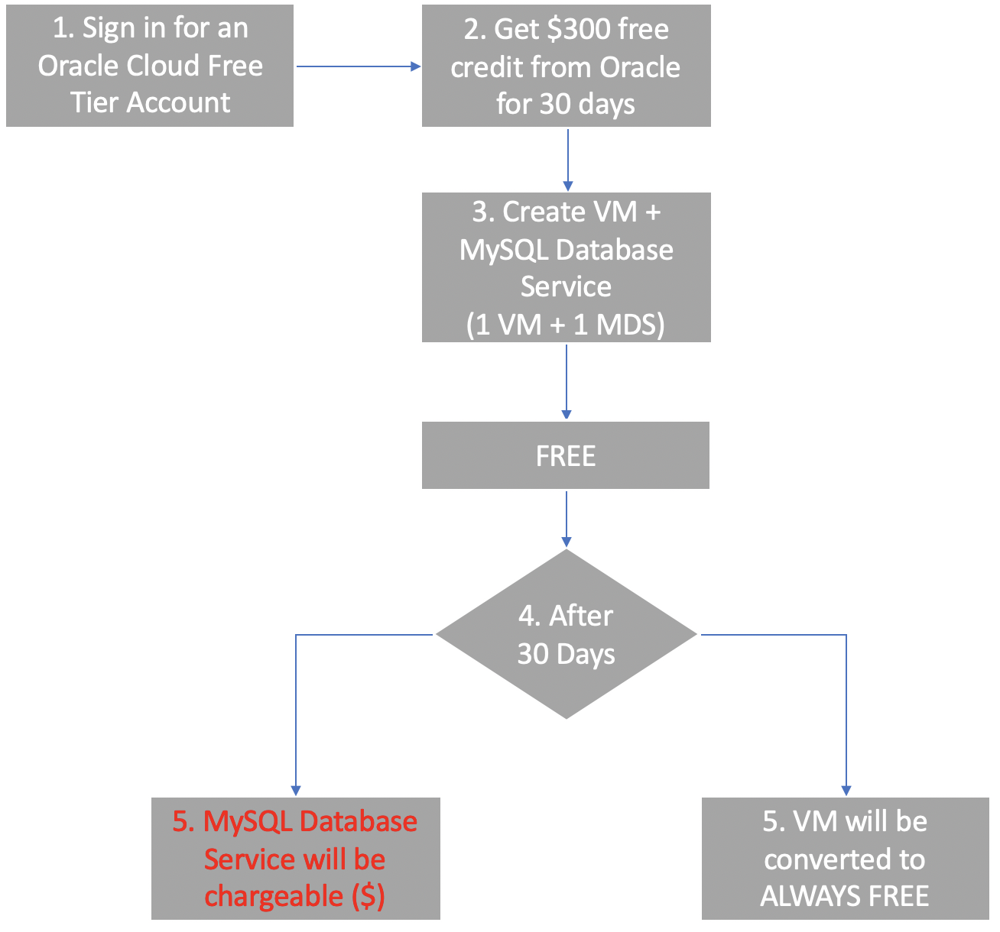

Oracle Cloud Free Tier allows you to sign up for an Oracle Cloud account which provides a number of Always Free services and a Free Trial with US$300 of free credit to use on all eligible Oracle Cloud Infrastructure services for up to 30 days. The Always Free services are available for an unlimited period of time. 
The Free Trial services may be used until your US$300 of free credits are consumed or the 30 days has expired, whichever comes first (source: https://www.oracle.com/sg/cloud/free/faq.html)
  
That means:   

